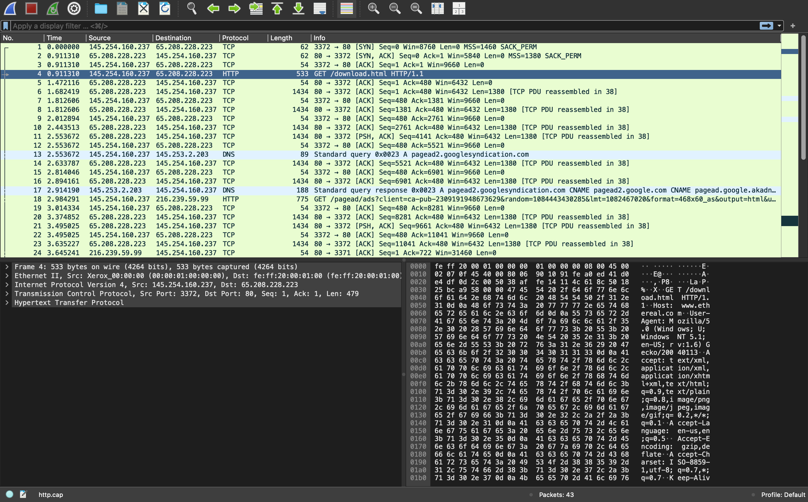
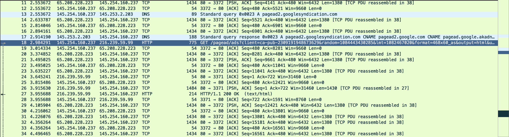
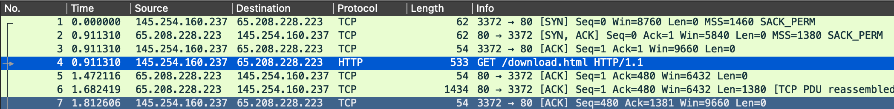
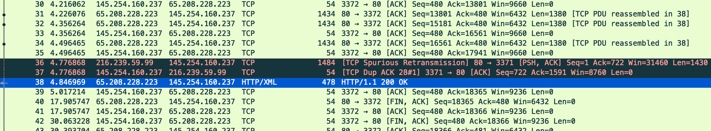
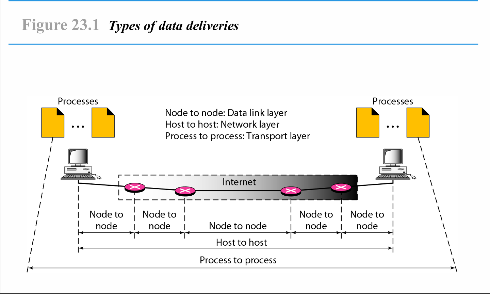

  <h1 style="text-align: center;font-weight: bold">Praktikum 1 Admin Jaringan</h1>
  <h4 style="text-align: center;">Dosen Pengampu : Dr. Ferry Astika Saputra, S.T., M.Sc.</h4>

 

  
  <h3 style="text-align: center;">Disusun Oleh : </h3>
  

    <strong>Nama : Adrian Yoga Chrisarianto</strong> 
    <strong>Kelas : 2 D3 IT A</strong> 
    <strong>NRP : 3123500021</strong>
  

<h3 style="text-align: center;line-height: 1.5">Politeknik Elektronika Negeri Surabaya Departemen Teknik Informatika Dan Komputer Program Studi Teknik Informatika 2024/2025</h3>
  

## Daftar Isi
- [Analisa file http.cap dengan wireshark](#analisa-file-httpcap-dengan-wireshark)
    - [1. Versi HTTP yang Digunakan](#1-versi-http-yang-digunakan)
    - [2. IP Address dari Client dan Server](#2-ip-address-dari-client-dan-server)
    - [3. Waktu dari Client Mengirimkan HTTP Request](#3-waktu-dari-client-mengirimkan-http-request)
    - [4.  Waktu dari server mengirinmkan server dan durasinya](#4--waktu-dari-server-mengirinmkan-server-dan-durasinya)
- [Deskripsi gambar pada slide 3](#deskripsi-gambar-pada-slide-3)
  - [1. Pendahuluan](#1-pendahuluan)
  - [2. Node to Node (Data Link Layer)](#2-node-to-node-data-link-layer)
  - [3. Host to Host (Network Layer)](#3-host-to-host-network-layer)
  - [4. Process to Process (Transport Layer)](#4-process-to-process-transport-layer)
  - [5. Alur Pengiriman Data](#5-alur-pengiriman-data)
- [Kesimpulan](#kesimpulan)
  - [Referensi](#referensi)

# Analisa file http.cap dengan wireshark
### 1. Versi HTTP yang Digunakan

Berdasarkan informasi pada gambar diatas, dapat dilihat bahwa permintaan GET terhadap /download.html menggunakan protokol HTTP/1.1. Respon yang diberikan oleh server juga menggunakan HTTP/1.1 dengan status 200 OK. Dengan demikian, versi HTTP yang digunakan dalam komunikasi ini adalah HTTP/1.1.

### 2. IP Address dari Client dan Server
- Client IP Address:
  
  Dari paket pertama (baris ke-18), Source IP adalah 145.254.160.237, yang menunjukkan bahwa ini adalah IP Client.  
- Server IP Address:
  
  Dari paket ke-38 dan 27 (HTTP/1.1 200 OK), Source IP adalah 65.208.228.223 dan 216.239.59.99.  Ini menunjukkan bahwa server memiliki IP 65.208.228.223 dan 216.239.59.99.
### 3. Waktu dari Client Mengirimkan HTTP Request

dari gambar diatas Pada baris ke-4 (GET /download.html) dapat dilihat waktu tercatat di kolom Time adalah 0.911310 detik.
### 4.  Waktu dari server mengirinmkan server dan durasinya

Dari gambar diatas baris ke-38 (HTTP/1.1 200 OK) dapat dilihat bahwa server merespons permintaan pada 4.846969 detik. Durasi dihitung dari ( waktu dari server - waktu dari client ) dengan durasi 3,935659

# Deskripsi gambar pada slide 3

## 1. Pendahuluan
Gambar di atas menjelaskan cara data dikirimkan melalui beberapa tingkatan (lapisan) dalam sebuah jaringan. Setiap tingkatan memiliki peran yang berbeda dalam memastikan data dapat sampai dari proses pengirim ke proses penerima. Secara garis besar, ada tiga jenis pengiriman data yang ditunjukkan, yaitu:

1. **Node to Node** (lapisan Data Link)  
2. **Host to Host** (lapisan Network)  
3. **Process to Process** (lapisan Transport)

Ketiga jenis pengiriman ini saling berhubungan dan membentuk aliran data yang utuh, mulai dari proses di komputer pengirim hingga proses di komputer penerima.

---

## 2. Node to Node (Data Link Layer)
Pada level **Node to Node**, data dikirimkan antar perangkat fisik yang terhubung secara langsung (misalnya, antara dua router, switch, atau perangkat jaringan lainnya). Hal ini berlangsung di lapisan **Data Link**.

- **Fungsi Utama:**  
  - Menangani pengalamatan fisik (MAC address).  
  - Deteksi dan koreksi kesalahan tingkat fisik.  
  - Mengatur bagaimana bit-bit data diubah menjadi frame untuk dikirimkan di media fisik.

- **Contoh Implementasi:**  
  - Ethernet  
  - Wi-Fi (IEEE 802.11)  
  - Teknologi lain pada lapisan Data Link

---

## 3. Host to Host (Network Layer)
Setelah data dapat dikirim di antara node-node jaringan, proses berikutnya adalah pengiriman **Host to Host** di lapisan **Network**.

- **Fungsi Utama:**  
  - Menentukan jalur terbaik (routing) di antara berbagai perangkat (router) di internet atau intranet.  
  - Mengelola pengalamatan logis (misalnya IP address).  
  - Memecah data menjadi paket-paket.

- **Contoh Implementasi:**  
  - Internet Protocol (IP)  
  - Routing protocol (OSPF, RIP, BGP)

---

## 4. Process to Process (Transport Layer)
Pada level **Process to Process**, data dikirimkan dari proses aplikasi pengirim ke proses aplikasi penerima di lapisan **Transport**.

- **Fungsi Utama:**  
  - Menyediakan layanan end-to-end seperti pengaturan sesi komunikasi.  
  - Segmentasi dan reassembly data.  
  - Pengendalian aliran dan keandalan transmisi.

- **Contoh Implementasi:**  
  - TCP (Transmission Control Protocol) yang andal dan berorientasi koneksi.  
  - UDP (User Datagram Protocol) yang tidak berorientasi koneksi namun lebih ringan dan cepat.

---

## 5. Alur Pengiriman Data

1. **Proses (Aplikasi) di Komputer Pengirim** menyiapkan data dan menyerahkannya ke lapisan Transport.  
2. **Lapisan Transport** membagi data menjadi segmen, menambahkan header yang berisi informasi seperti nomor port sumber dan tujuan.  
3. **Lapisan Network** menerima segmen, mengubahnya menjadi paket, menambahkan header IP (alamat sumber dan tujuan), dan menentukan rute terbaik untuk pengiriman.  
4. **Lapisan Data Link** bertugas mengubah paket menjadi frame dan mengirimkannya antar node (misalnya antar router) sampai paket tiba di host tujuan.  
5. **Lapisan Transport di Host Tujuan** kemudian menyusun kembali segmen-segmen menjadi data utuh dan menyerahkannya ke proses atau aplikasi yang dimaksud.

# Kesimpulan
Gambar “Types of Data Deliveries” menyoroti pentingnya pembagian tugas pada setiap lapisan dalam komunikasi data. Mulai dari pengiriman antar node (Data Link), pengalamatan serta routing antar host (Network), hingga pengaturan transmisi data dari proses ke proses (Transport). Dengan memahami konsep ini, kita dapat melihat bagaimana data dapat sampai secara utuh dan andal dari satu titik ke titik lainnya dalam sebuah jaringan, baik itu jaringan lokal maupun internet.

## Referensi
- [Sample Captures HyperText Transport Protocol (HTTP)](https://wiki.wireshark.org/samplecaptures#tcp) 

- [wireshark](https://www.wireshark.org/)

- [Data Link Layer](https://www.geeksforgeeks.org/data-link-layer/)
