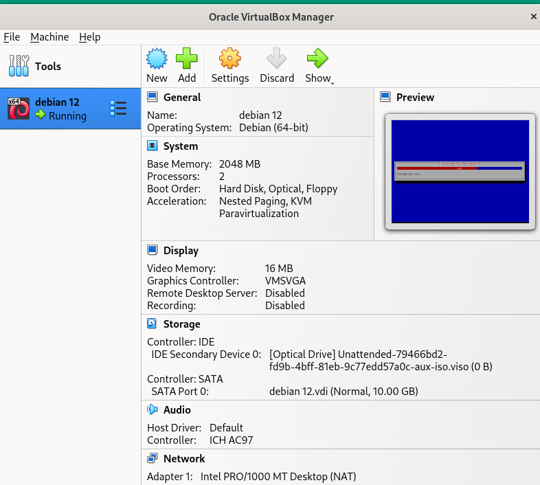
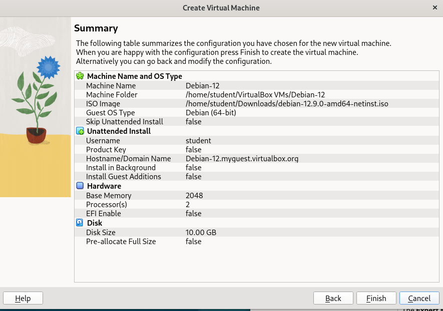
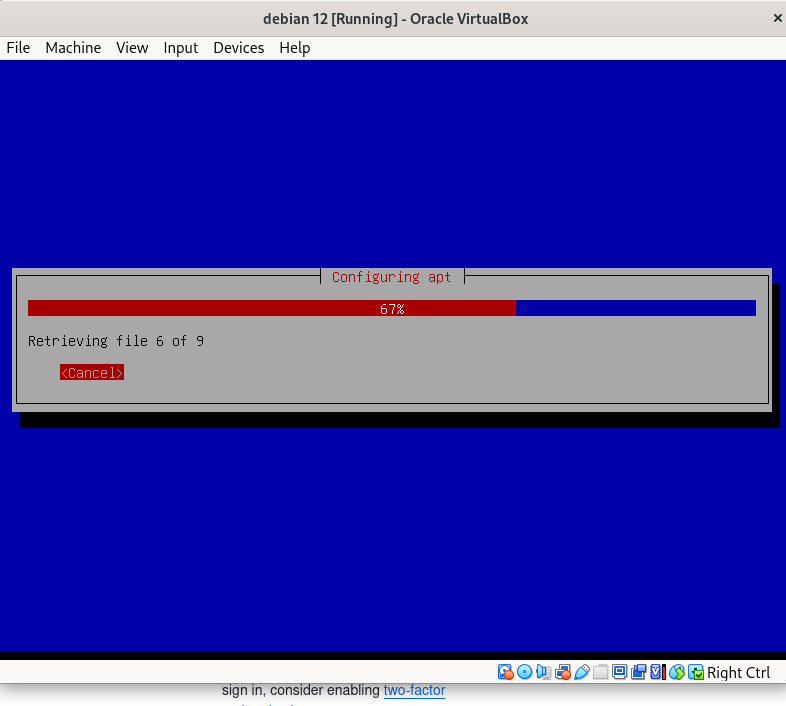
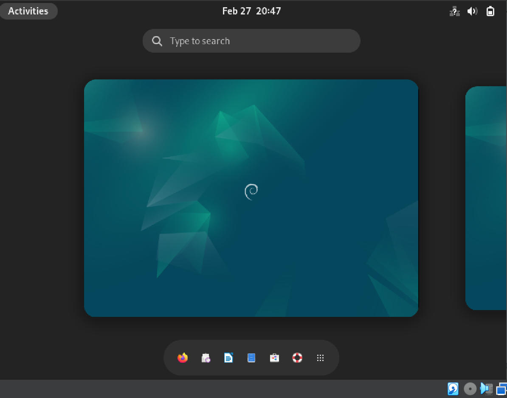

<div align="center">
  <h1 style="text-align: center;font-weight: bold">Praktikum 2<br>Admin Jaringan</h1>
  <h4 style="text-align: center;">Dosen Pengampu : Dr. Ferry Astika Saputra, S.T., M.Sc.</h4>
</div>
<br />
<div align="center">
  
  <h3 style="text-align: center;">Disusun Oleh : </h3>
  <p style="text-align: center;">
    <strong>Nama : Adrian Yoga Chrisarianto</strong><br>
    <strong>Kelas : 2 D3 IT A</strong><br>
    <strong>NRP : 3123500021</strong>
  </p>

<h3 style="text-align: center;line-height: 1.5">Politeknik Elektronika Negeri Surabaya<br>Departemen Teknik Informatika Dan Komputer<br>Program Studi Teknik Informatika<br>2024/2025</h3>
  <hr><hr>
</div>

## Daftar Isi
- [Menginstall Debian Linux dengan VirtualBox melalui root terminal pada OS Linux](#menginstall-debian-linux-dengan-virtualbox-melalui-root-terminal-pada-os-linux)  
  - [1. Check Ubuntu Version](#1-check-ubuntu-version)  
    - [Perintah terminal](#perintah-terminal)  
    - [Hasil](#hasil)  
  - [2. Check Dependensi](#2-check-dependensi)  
    - [Perintah terminal](#perintah-terminal-1)  
  - [3. Install VirtualBox Debian menggunakan paket melalui terminal](#3-install-virtualbox-debian-menggunakan-paket-melalui-terminal)  
    - [Perintah terminal](#perintah-terminal-2)  
  - [4. Problem Solve Error Installing](#4-problem-solve-error-installing)  
    - [Perintah terminal](#perintah-terminal-3)  
  - [5. Menambah User VirtualBox](#5-menambah-user-virtualbox)  
    - [Perintah terminal](#perintah-terminal-4)  
  - [6. Interface Installation VirtualBox Debian](#6-interface-installation-virtualbox-debian)  
    - [Persiapan File ISO](#persiapan-file-iso)  
    - [Konfigurasi Virtual Machine](#konfigurasi-virtual-machine)  
    - [Validasi Kebutuhan install](#validasi-kebutuhan-install)  
    - [Proses instalasi berjalan](#proses-instalasi-berjalan)  
    - [Instalasi VirtualBox Debian Linux Berhasil](#instalasi-virtualbox-debian-linux-berhasil)  

- [Rangkuman Unix dan Linux](#rangkuman-unix-dan-linux)  
  - [Chapter 4: Process Control](#chapter-4-process-control)  
  - [Chapter 5: The Filesystem](#chapter-5-the-filesystem)  
  - [Chapter 6: Software Installation and Management](#chapter-6-software-installation-and-management)  

# Menginstall Debian Linux dengan VirtualBox melalui root terminal pada OS Linux
## 1. Check Ubuntu Version
### Perintah terminal
```
lsb_release -a
```
Untuk mengecheck versi ubuntu yang sudah terinstall
### Hasil


## 2. Check Dependensi
### Perintah terminal
```
sudo apt --fix-broken install
```
Perintah diatas untuk memperbaiki dependensi yang belum terpenuhi atau paket yang rusak pada sistem berbasis Linux

## 3. Install VirtualBox Debian menggunakan paket melalui terminal
### Perintah terminal
```
sudo dpkg -i virtualbox-7.1_7.1.6-167084~Debian~bookworm_amd64.deb
```
Perintah diatas berfungsi untuk menginstal paket VirtualBox versi 7.1.6 dari file .deb secara manual menggunakan dpkg (Debian Package Manager).

## 4. WProblem Solve Error Installing
Setelah install virtualbox dan jika muncul error
```
error The following NEW packages will be installed:
  libxcb-cursor0
```
Install library libxcb-cursor0 pada sistem berbasis Linux

### Perintah terminal
```
sudo apt install libxcb-cursor0
```

## 5. Menambah User VirtualBox
### Perintah terminal
```
sudo usermod -aG vboxusers$
```
menambahkan pengguna saat ini ke dalam grup vboxusers, yang diperlukan agar pengguna dapat menggunakan fitur tertentu di VirtualBox, seperti akses ke perangkat USB.

## 6. Interface Installation VirtualBox Debian


### Persiapan File ISO
- Jika sudah memiliki file **ISO Debian 12**, masukkan lokasinya di kolom **ISO Image** pada pengaturan VM.
- Jika belum, unduh dari [debian.org](https://www.debian.org/distrib/) atau transfer dari PC lain menggunakan **SFTP**:

```bash
sftp <IP Address>
cd Downloads
get debian-12.9.0-amd64-netinst.iso
```
*(Gantilah `<IP Address>` dengan alamat IP komputer yang memiliki file ISO Debian.)*

### Konfigurasi Virtual Machine

**Atur spesifikasi seperti dibawah ini:**  
✅ **RAM**: 2 GB  
✅ **CPU**: 2 Core  
✅ **HDD**: 10 GB  

### Validasi Kebutuhan install

Jika sudah sesuai dengan spesifikasi yang diinginkan lanjut klik Finish untuk memproses instalasi.

### Proses instalasi berjalan

Tunggu hingga proses instalasi selesai

### Instalasi Virtualbox Debian Linux Berhasil

Proses instalasi melalui terminal dengan akses root pada OS Linux telah selesai.


# Rangkuman Unix dan Linux
## Chapter 4: Process Control  
Bab ini menjelaskan bagaimana sistem operasi menangani proses. Setiap proses memiliki ruang alamat sendiri serta struktur data dalam kernel, termasuk informasi seperti **PID** (Process ID), **PPID** (Parent Process ID), serta **UID** dan **EUID** yang menentukan hak akses pengguna.  

Siklus hidup suatu proses dimulai dengan `fork`, di mana sebuah proses menduplikasi dirinya untuk membuat proses baru. Sistem operasi juga memanfaatkan **signals** untuk komunikasi antar proses, seperti `KILL`, `INT`, dan `TERM` yang digunakan untuk menghentikan proses.  

Pemantauan proses dapat dilakukan menggunakan perintah seperti `ps`, `top`, dan `htop` untuk melihat penggunaan CPU dan memori oleh proses yang berjalan. Perintah `kill` digunakan untuk menghentikan proses, sedangkan `nice` dan `renice` digunakan untuk mengatur prioritas eksekusi proses.  

Sistem berkas virtual `/proc` menyimpan berbagai informasi tentang proses yang sedang berjalan. Selain itu, alat seperti `strace` dapat digunakan untuk menganalisis aktivitas suatu proses, sedangkan `cron` memungkinkan penjadwalan tugas secara otomatis.  

---  

## Chapter 5: The Filesystem  
Bab ini membahas struktur sistem berkas pada UNIX/Linux, yang mencakup **namespace** (hirarki direktori), **API** (sistem panggilan untuk manipulasi berkas), **model keamanan**, serta implementasi fisiknya di media penyimpanan.  

Berbagai sistem berkas yang umum digunakan antara lain **ext4, XFS, NTFS, dan ISO 9660** untuk media optik seperti CD/DVD. Setiap berkas memiliki **jalur (path)** yang dapat berupa absolute atau relative. Sistem berkas dapat di-*mount* menggunakan perintah `mount` dan di-*unmount* dengan `umount`.  

UNIX memiliki beberapa jenis berkas, termasuk **berkas reguler, direktori, berkas perangkat, symbolic links, serta named pipes**. Hak akses berkas dikontrol menggunakan bit **read (r), write (w), dan execute (x)**, yang dapat diubah menggunakan `chmod` dan `chown`.  

Fitur tambahan seperti **Access Control Lists (ACLs)** memungkinkan pengaturan hak akses yang lebih rinci. Selain itu, sistem berkas juga memiliki mekanisme seperti **sticky bit, setuid, dan setgid** untuk mengatur izin eksekusi tertentu.  

---  

## Chapter 6: Software Installation and Management  
Bab ini membahas bagaimana perangkat lunak dikelola dalam sistem UNIX/Linux. Instalasi sistem operasi dapat dilakukan melalui media fisik seperti **USB/DVD** atau melalui jaringan menggunakan **PXE (Preboot Execution Environment)**.  

Linux memiliki dua sistem utama untuk manajemen paket:  
- **RPM** (digunakan di *Red Hat, CentOS, Fedora, SUSE*)  
- **DEB** (digunakan di *Debian, Ubuntu*)  

Untuk mengelola paket, sistem berbasis **Debian** menggunakan **APT (Advanced Package Tool)**, sedangkan distribusi berbasis **RPM** menggunakan **YUM**. Repositori paket menyimpan berbagai perangkat lunak yang dapat diunduh dan diperbarui secara otomatis.  

Selain itu, konfigurasi perangkat lunak dapat disesuaikan dengan lingkungan **lokal** maupun **cloud** agar lebih fleksibel dan memudahkan pemulihan dalam kasus kegagalan sistem.
